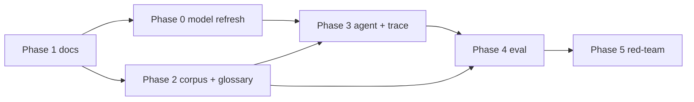

# Agentic RAG Portfolio Roadmap
- **Last Updated**: 2026-08-07
- **Canonical Issue**: [#30](https://github.com/SteveLeve/chatbot-demo-cloudflare/issues/30) (epic)

## Now

See [`../status/now-next.md`](../status/now-next.md).

## Phases

| Phase | Deliverable | Issue | Exit criteria |
|-------|-------------|-------|---------------|
| 1 | Vision / spec / ADR / docs reframe | this PR | No doc contradicts the north star; spec + ADR reviewed |
| 0 | Model refresh — `@cf/meta/llama-4-scout-17b-16e-instruct`; keep BGE embeddings | [#32](https://github.com/SteveLeve/chatbot-demo-cloudflare/issues/32) | No deprecated generation model in code/docs; Scout supports function calling; IDs in `src/config/models.ts` |
| 2 | Curated corpus + static corpus browser + glossary prompt injection | [#33](https://github.com/SteveLeve/chatbot-demo-cloudflare/issues/33) | Corpus reproducible from a fresh clone; article list visible without a network round-trip; glossary terms inject working queries |
| 3 | Agents SDK RAG agent + step transparency (trace UI) | [#34](https://github.com/SteveLeve/chatbot-demo-cloudflare/issues/34) | Every agent action visible and explained; trace entries correlate to Workers logs by `traceId`; no framework owns the loop |
| 4 | Eval reporting surface (demo-scale gold set) | [#35](https://github.com/SteveLeve/chatbot-demo-cloudflare/issues/35) | Report readable and self-explaining; failure cases shown; methodology limits stated on the page |
| 5 | Red-team / adversarial demo mode | [#36](https://github.com/SteveLeve/chatbot-demo-cloudflare/issues/36) | Concrete defense demonstrated per scenario; out-of-corpus questions refuse visibly; red-team traffic not silently logged |

Phase 0 is numbered zero because it was identified after the phase list was fixed and it *precedes*
Phase 2 in execution order. It is a prerequisite, not an afterthought.

## Dependencies

- **Phase 3 blocked by Phase 0** — an agent loop needs a function-calling model; the current one is deprecated.
- **Phase 3 config landed** — `wrangler.jsonc` has `RAG_AGENT` + `v1-rag-agent` migration (#34).
- **Phase 4 blocked by Phase 2** — a gold set is only meaningful against a stable, curated corpus.
- **Phase 5 coupled to [#19](https://github.com/SteveLeve/chatbot-demo-cloudflare/issues/19)** — red-team mode increases retained prompt text, so privacy endpoints are not merely deprioritized.

## Objectives

- Demonstrate agentic architecture on Cloudflare (Agents SDK), not framework-vs-handcrafted.
- Keep the corpus constrained, committed, and fully inspectable.
- Make retrieval, tools, and generation transparent — and correlatable with production logs.
- Teach eval and red-team concepts with working demo surfaces, without overclaiming.

## Links

- Spec: [`../spec/spec-agentic-rag-portfolio.md`](../spec/spec-agentic-rag-portfolio.md)
- ADR: [`../decisions/adr-20260807-agents-sdk-runtime.md`](../decisions/adr-20260807-agents-sdk-runtime.md)
- Status: [`../status/now-next.md`](../status/now-next.md)
