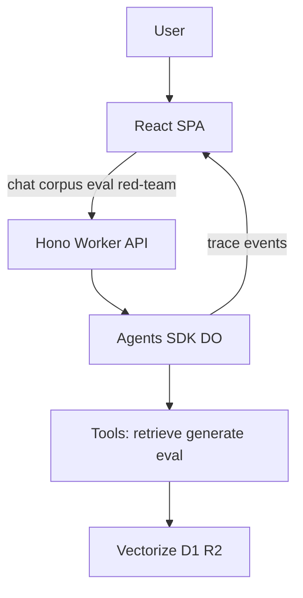

# Spec: Agentic RAG Portfolio Reimagining
- **Date**: 2026-08-07
- **Status**: In Review
- **Owners**: Project Maintainer
- **Issues/PRs**: #30

## Goal

Reposition this portfolio demo as a **Cloudflare-first agentic RAG** showcase that teaches essential retrieval-augmented generation concepts while demonstrating production-shaped agentic architecture on the Cloudflare platform.

**Success criteria**
- Visitors understand what corpus knowledge is available and how answers are grounded in it.
- Agent actions (tools, retrieval, generation) are visible and explained—not a black box.
- Evaluation reporting and red-team concepts are first-class demo surfaces, not FAQ footnotes.
- Implementation stays platform-native: **Cloudflare Agents SDK** + Workers AI + Vectorize + D1 + R2 + Workflows; no third-party agent frameworks for the core loop.

## Scope

### In scope
- Constrained Wikipedia (or equivalent) corpus; size remains demo-bounded.
- Browseable **static corpus** UI so users can inspect source documents.
- **Glossary → example prompt** injection into the chat flow.
- **Agents SDK** Durable Object agent with transparent step/trace UI.
- **Eval reporting** over a small gold set (faithfulness / groundedness / retrieval relevance style metrics).
- **Red-team mode**: curated adversarial prompts and expected defenses (prompt injection, out-of-corpus asks, hallucination pressure).
- Living docs: vision (this spec), ADR, roadmap, now-next, README positioning.

### Out of scope
- Unbounded / open-web retrieval.
- LangChain agents, vendor agent platforms, or other ad-hoc frameworks as the primary agent runtime.
- Full compliance productization beyond existing demo hardening (tracked separately, e.g. #19).
- Multi-tenant SaaS packaging.

## Design / Flow

### Primary demo flows
1. **Ask** — User submits a question (typed or glossary-injected). Agent retrieves, generates, emits a step trace; UI shows answer + sources + trace.
2. **Browse corpus** — User opens corpus browser, lists articles/chunks available to the system, optionally jumps to a related example prompt.
3. **Evaluate** — User runs or views eval report against a fixed gold set; metrics and failure examples are explained.
4. **Red-team** — User picks a curated adversarial prompt; system shows defense behavior and educational copy.

### Edge cases
- Empty / insufficient retrieval → refuse or say “not in corpus,” with trace showing low similarity / no hits.
- Out-of-corpus questions → explicit refusal path surfaced in red-team and normal modes.
- Rate limits / model errors → structured error in UI; no silent hallucination.

## API / Interfaces

Contracts for later implementation PRs (shapes may evolve; keep OpenAPI/types in sync):

| Surface | Intent |
|---------|--------|
| `POST /api/v1/agent/query` (or Agents SDK websocket/HTTP per SDK patterns) | Run agent turn; stream or return answer + **trace events** |
| `GET /api/v1/corpus` / `GET /api/v1/corpus/:id` | List/read static corpus metadata and article bodies for the browser |
| `GET /api/v1/eval/report` (and optional `POST .../run`) | Demo-scale eval report payload |
| `GET /api/v1/redteam/scenarios` | Curated adversarial scenarios + expected defense notes |
| Glossary content | Each term may include `examplePrompts[]` consumed by chat UI |

### Trace event (UI contract)
Each step should be renderable as: `id`, `type` (`retrieve` | `tool` | `generate` | `guard` | `eval`), `summary`, optional `detail` (chunk ids, scores, latency), `timestamp`.

### UX surfaces
- **Trace panel** — tool calls, retrieval hits, generation steps.
- **Corpus browser** — static listing of ingested articles (and optionally chunks).
- **Glossary → prompts** — terms inject example queries into the input.
- **Eval reporting** — scores + short explanations on a constrained gold set.
- **Red-team mode** — scenario picker + outcome + teaching notes.

Retain and extend: educational sidebar, FAQ, Sources card patterns in `ui/`.

## Risks & Trade-offs

| Risk | Mitigation |
|------|------------|
| Agents SDK learning curve / API churn | Lock ADR; cite official Cloudflare docs; thin adapter layer |
| Trace UI noise | Default to summarized steps; expand for detail |
| Eval metrics overclaiming | Label as **demo-scale**; document methodology limits |
| Red-team prompts misused | Curated list only; educational framing; no attack tooling |
| Migration from `basic-rag` route | Keep Phase 1 basic path until Agents SDK path is feature-complete; then deprecate |

## Testing & Acceptance

- **Docs (Phase 1)**: Spec, ADR, roadmap, now-next, README align with #30.
- **Later phases**: Unit tests for tools/guards; integration tests for agent turns with mocked AI; Playwright for corpus browser, glossary inject, trace panel, eval/red-team pages.
- **Exit (full epic)**: Acceptance checklist on #30 complete; live demo reflects north star.

## Rollout

1. Land docs/ADR (this phase).
2. Ship UI/API slices behind clear routes (corpus → agent+trace → eval → red-team).
3. Update README “Current Features” as each phase ships; keep `wrangler` deploy path unchanged.
4. Monitor Workers logs / existing observability for agent latency and error rates.

## References
- Epic: https://github.com/SteveLeve/chatbot-demo-cloudflare/issues/30
- ADR: `docs/decisions/adr-20260807-agents-sdk-runtime.md`
- Roadmap: `docs/roadmaps/agentic-rag.md`
- Current RAG: `src/patterns/basic-rag.ts`
- Glossary: `ui/src/content/glossary-data.ts`
