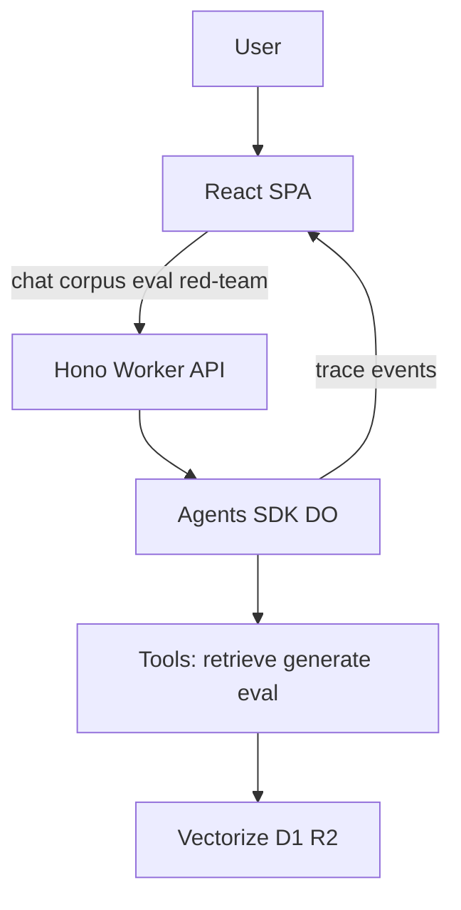

# Spec: Agentic RAG Portfolio Reimagining
- **Date**: 2026-08-07
- **Status**: In Review
- **Owners**: Project Maintainer
- **Issues/PRs**: #30

## Goal

Reposition this portfolio demo as a **Cloudflare-first agentic RAG** showcase that teaches essential retrieval-augmented generation concepts while demonstrating production-shaped agentic architecture on the Cloudflare platform.

**Success criteria**
- Visitors understand what corpus knowledge is available and how answers are grounded in it.
- Agent actions (tools, retrieval, generation) are visible and explained—not a black box.
- Evaluation reporting and red-team concepts are first-class demo surfaces, not FAQ footnotes.
- Implementation stays platform-native: **Cloudflare Agents SDK** + Workers AI + Vectorize + D1 + R2 + Workflows; no third-party agent frameworks for the core loop.

## Scope

### In scope
- Curated, committed demo corpus (see **Corpus** below).
- Browseable **static corpus** UI so users can inspect source documents.
- **Glossary → example prompt** injection into the chat flow.
- **Agents SDK** Durable Object agent with transparent step/trace UI.
- **Eval reporting** over a small gold set (faithfulness / groundedness / retrieval relevance style metrics).
- **Red-team mode**: curated adversarial prompts and expected defenses (prompt injection, out-of-corpus asks, hallucination pressure).
- Model refresh (see **Model Selection** below) — a Phase 0 prerequisite, not a Phase 3 detail.
- Living docs: vision (this spec), ADR, roadmap, now-next, README positioning.

### Out of scope
- Unbounded / open-web retrieval.
- LangChain / LlamaIndex agents or vendor agent platforms as the primary agent runtime. (The Vercel AI SDK + `workers-ai-provider` *is* permitted as an adapter-confined model/tool layer — see the ADR's boundary table.)
- Full compliance productization beyond existing demo hardening (tracked separately, e.g. #19).
- Multi-tenant SaaS packaging.

### Corpus

Today `data/wikipedia/` holds ~2,364 fetched JSON articles, all gitignored (`.gitignore:59` — only `.gitkeep` and `README.md` are tracked). The demo's knowledge is therefore **not reproducible from a clone**, which directly undercuts the "see exactly what information is available" promise. This phase resolves that.

- **Canonical corpus**: ~25–50 curated articles **committed to the repo** under a tracked path (proposed: `data/corpus/`), chosen for thematic coherence so that eval gold sets and red-team "out-of-corpus" cases are meaningful rather than arbitrary. A haystack of 2,364 Simple English stubs cannot be meaningfully inspected by a visitor, and makes "is this question in-corpus?" unanswerable.
- **Build-time manifest**: a generated static JSON (`title`, `id`, `charCount`, `sourceUrl`, `chunkCount`) ships with the SPA bundle. *This* is what makes the corpus browser static content — no API round-trip to answer "what does this system know?"
- **Dynamic only for bodies**: `GET /api/v1/corpus/:id` serves full article text from R2 on demand, so the bundle stays small.
- **Migration**: `scripts/fetch-wikipedia.py`, `scripts/ingest-wikipedia.js`, `src/ingestion-workflow.ts`, and the size guidance in `data/wikipedia/README.md` ("Quick demo: 5-10 MB (~1000-2000 articles)") all currently assume the large fetched set and must be re-pointed at the curated corpus.

## Model Selection (Phase 0)

The demo's current models predate this reimagining and one of them is end-of-life. Selection is a **prerequisite for Phase 3**, because an agent loop needs a function-calling model.

| Concern | Current | Status |
|---------|---------|--------|
| Generation | `@cf/meta/llama-4-scout-17b-16e-instruct` (`src/config/models.ts`) | **Selected (Phase 0 / #32).** Function calling, 131k context, not deprecated. Replaces `@cf/meta/llama-3.1-8b-instruct`. |
| Embeddings | `@cf/baai/bge-base-en-v1.5`, 768-dim (`src/config/models.ts`) | **Verified current.** Keep; changing requires recreating Vectorize (see #20). |

**Requirements for the replacement generation model**
- Listed as supporting **function calling** in the Workers AI catalog (required by the Agents SDK tool loop).
- Context window large enough for retrieved chunks + tool results + system prompt across multiple steps.
- Not deprecated.

**Candidates** (current catalog, to be evaluated on latency/cost/quality): Llama 3.3 70B FP8-Fast, Llama 4 Scout 17B, GPT-OSS 20B / 120B, Qwen 3 30B, Mistral Small 3.1 24B.

**Embedding-change cost.** Changing the embedding model is not a config edit: it requires re-embedding the entire corpus and **recreating the Vectorize index**, which is provisioned with `--preset @cf/baai/bge-base-en-v1.5` (`package.json` → `vectorize:create`) and bound as `wikipedia-vectors`. Dimensions must match the preset. If the embedding model stays, this cost is avoided entirely — evaluate it separately from the generation-model swap. Note this also overlaps issue #20 (BGE-Large upgrade); reconcile rather than duplicating.

## Design / Flow

### Primary demo flows
1. **Ask** — User submits a question (typed or glossary-injected). Agent retrieves, generates, emits a step trace; UI shows answer + sources + trace.
2. **Browse corpus** — User opens corpus browser, lists articles/chunks available to the system, optionally jumps to a related example prompt.
3. **Evaluate** — User runs or views eval report against a fixed gold set; metrics and failure examples are explained.
4. **Red-team** — User picks a curated adversarial prompt; system shows defense behavior and educational copy.

### Edge cases
- Empty / insufficient retrieval → refuse or say “not in corpus,” with trace showing low similarity / no hits.
- Out-of-corpus questions → explicit refusal path surfaced in red-team and normal modes.
- Rate limits / model errors → structured error in UI; no silent hallucination.

## API / Interfaces

Contracts for later implementation PRs (shapes may evolve; keep OpenAPI/types in sync):

| Surface | Intent |
|---------|--------|
| `POST /api/v1/agent/query` (or Agents SDK websocket/HTTP per SDK patterns) | Run agent turn; stream or return answer + **trace events** |
| Corpus manifest (**static**, bundled with the SPA) | Article list + metadata; no network call needed to see what the system knows |
| `GET /api/v1/corpus/:id` | Full article body from R2, fetched on demand |
| `GET /api/v1/eval/report` (and optional `POST .../run`) | Demo-scale eval report payload |
| `GET /api/v1/redteam/scenarios` | Curated adversarial scenarios + expected defense notes |
| Glossary content | Each term may include `examplePrompts[]` consumed by chat UI |

### Trace event (UI contract)

Each step should be renderable as: `type` (`retrieve` | `tool` | `generate` | `guard` | `eval`), `summary`, optional `detail` (chunk ids, scores, latency), `timestamp`.

**Reuse the existing trace identifiers — do not invent a parallel scheme.** `src/utils/trace.ts` already implements W3C traceparent (`TraceContext`, `createTraceContext`, `buildTraceparent`, `parseTraceparent`), and `src/utils/logger.ts` emits structured JSON carrying `traceId`/`spanId` (shipped in #29). UI trace events must carry those same `traceId`/`spanId` values so a step visible in the trace panel can be correlated with the Workers log line that produced it — that correlation is most of the educational value.

Note that `TRACE_SAMPLE_RATE` defaults to `0.05` in `wrangler.jsonc`; the trace panel needs per-request trace data regardless of the OTLP sampling decision, so Phase 3 must separate "emit UI trace events" from "export this trace to OTLP."

### UX surfaces
- **Trace panel** — tool calls, retrieval hits, generation steps.
- **Corpus browser** — static listing of ingested articles (and optionally chunks).
- **Glossary → prompts** — terms inject example queries into the input.
- **Eval reporting** — scores + short explanations on a constrained gold set.
- **Red-team mode** — scenario picker + outcome + teaching notes.

Retain and extend: educational sidebar, FAQ, Sources card patterns in `ui/`.

## Risks & Trade-offs

| Risk | Mitigation |
|------|------------|
| Agents SDK learning curve / API churn | Lock ADR; cite official Cloudflare docs; thin adapter layer |
| Trace UI noise | Default to summarized steps; expand for detail |
| Eval metrics overclaiming | Label as **demo-scale**; document methodology limits |
| Red-team prompts misused | Curated list only; educational framing; no attack tooling |
| **Red-team prompts persisted to chat logs** | `CHAT_LOGGING_ENABLED: true` and `src/utils/chat-logger.ts` write prompts plus hashed IPs to D1 (`chat_sessions`, `chat_messages`). Red-team mode will drive adversarial text into that same store. Tag or exclude red-team sessions from logging; this couples Phase 5 to the privacy endpoints in #19. |
| **Generation model (was deprecated)** | Resolved in Phase 0 (#32): `@cf/meta/llama-4-scout-17b-16e-instruct`. |
| **Durable Objects not yet configured** | `wrangler.jsonc` has no `durable_objects` binding and no `migrations` entry. Phase 3 must add both, declaring the agent class under `new_sqlite_classes`. On the Workers Free plan only SQLite-backed DOs are available, capped at 100k requests/day and 5M row reads/day — a real ceiling for a public demo. |
| Migration from `basic-rag` route | Keep Phase 1 basic path until Agents SDK path is feature-complete; then deprecate. Note `src/types/index.ts:169` still types `pattern` as `'basic' \| 'reranking' \| 'refinement' \| 'agentic'` — that union encodes the retired taxonomy and should be refactored in Phase 3. |

## Testing & Acceptance

- **Docs (Phase 1)**: Spec, ADR, roadmap, now-next, README align with #30; no doc contradicts the north star.
- **Later phases**: Unit tests for tools/guards; integration tests for agent turns with mocked AI.
- **E2E**: `@playwright/test` is present in `devDependencies` but **no harness is configured** — there is no `test:e2e` script and no spec files (current suite is `tests/utils/validation.test.ts` and `tests/utils/security.test.ts` under vitest). Standing up the Playwright harness is itself a task, scheduled with Phase 2 (corpus browser) as the first thing it covers, then glossary inject, trace panel, eval, and red-team pages.
- **Exit (full epic)**: Acceptance checklist on #30 complete; live demo reflects north star.

## Rollout

1. Land docs/ADR (this phase).
2. Phase 0: model refresh — swap the deprecated generation model before any agent work begins.
3. Ship UI/API slices behind clear routes (corpus → agent+trace → eval → red-team).
4. Phase 3 adds `durable_objects` bindings and a `migrations` entry (`new_sqlite_classes`) to `wrangler.jsonc` — the first change to the deploy configuration in this epic.
5. Update README “Current Features” as each phase ships; keep the `npm run deploy` path unchanged.
6. Monitor Workers logs / existing observability for agent latency, DO request volume against free-plan caps, and error rates.

## References
- Epic: https://github.com/SteveLeve/chatbot-demo-cloudflare/issues/30
- ADR: `docs/decisions/adr-20260807-agents-sdk-runtime.md`
- Roadmap: `docs/roadmaps/agentic-rag.md`
- Current RAG: `src/patterns/basic-rag.ts`
- Existing trace/logging utilities: `src/utils/trace.ts`, `src/utils/logger.ts`
- Chat logging (privacy interaction): `src/utils/chat-logger.ts`, `src/utils/privacy.ts`
- Glossary: `ui/src/content/glossary-data.ts`
- Workers AI model catalog: https://developers.cloudflare.com/workers-ai/models/
- Durable Objects pricing & free-plan limits: https://developers.cloudflare.com/durable-objects/platform/pricing/
